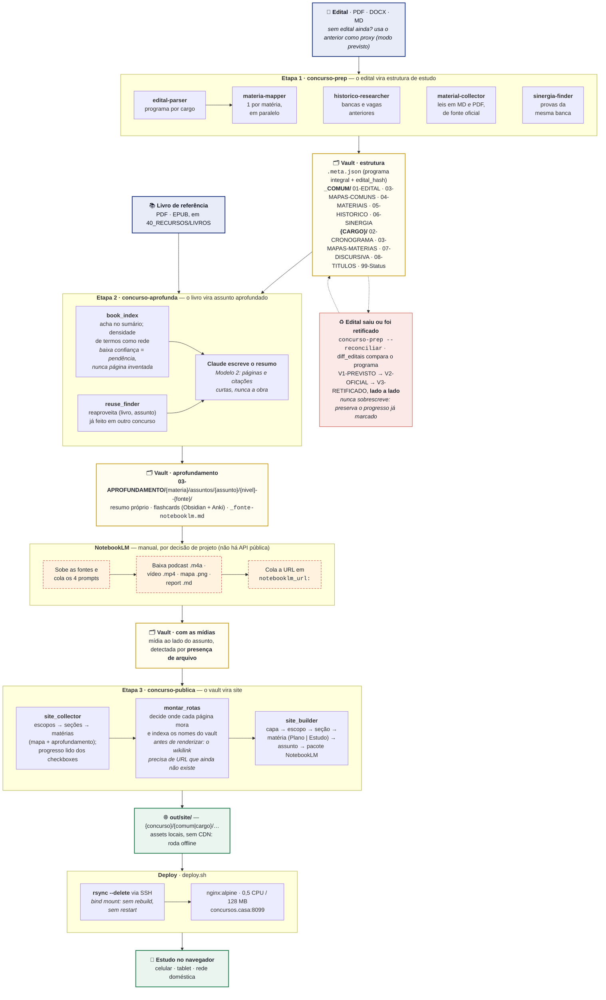

# concursos-vault-skills

Skills do [Claude Code](https://claude.com/claude-code) que automatizam a preparação para **concursos públicos brasileiros**, gerando material de estudo estruturado direto num **vault Obsidian** — e publicando tudo como site navegável.

## As skills

| Skill | Etapa | O que faz |
|---|---|---|
| **`concurso-prep`** | 1 | Do **edital** → estrutura completa de estudos: cronograma adaptativo (até 4 fases, conforme o prazo), mapas por matéria, análise da banca, histórico do órgão, leis baixadas (MD+PDF), sinergias entre concursos |
| **`concurso-aprofunda`** | 2 | Do **livro de referência** → um `.md` por assunto (resumo próprio + páginas do livro + citações curtas), flashcards (Obsidian/Anki) e o pacote para gerar podcast/mapa mental/vídeo/report no NotebookLM |
| **`concurso-publica`** | 3 | Do **vault** → site estático navegável com **todo** o conteúdo do concurso, espelhando a organização em COMUM e cargos: edital, cronograma, mapas de matéria, leis, histórico, sinergia, discursiva e o aprofundamento — com o podcast tocando, o vídeo rodando, flashcards como quiz e os prompts do NotebookLM a um toque |

Cada etapa consome a saída da anterior.

## O fluxo, do edital ao site no ar



Fonte em [`docs/fluxo-concurso.mmd`](docs/fluxo-concurso.mmd), que traz também as notas
de layout. Por que este desenho e não outro está em
[`docs/ARQUITETURA.md`](docs/ARQUITETURA.md#o-fluxo-completo-do-edital-ao-site-no-ar).

### Destaques

- **Modo previsto**: começa a estudar antes do edital sair, usando o edital anterior como proxy (cronograma sem datas, tudo marcado como provisório).
- **Reconciliação e retificação**: quando o edital sai (ou é retificado), gera nova versão lado a lado (`V1-PREVISTO` → `V2-OFICIAL` → `V3-RETIFICADO`), com diff de conteúdo programático e de estrutura da prova (vagas, salário, nº de questões), preservando o progresso já feito.
- **Reaproveitamento entre concursos**: se um assunto já foi aprofundado com o mesmo livro em outro concurso, a skill detecta e reaproveita em vez de refazer.
- **Localização automática no livro**: casa cada assunto do edital com as páginas do livro (via sumário ou densidade de termos), com score de confiança — e marca como pendência o que não achou com segurança.
- **Vários aprofundamentos por assunto**: o mesmo assunto pode ter versões de fontes diferentes e em dois níveis (padrão para revisão, detalhado para domínio), selecionáveis no site.
- **Uma matéria, duas visões**: no site, cada matéria abre em **Plano** (os tópicos do edital, com os subtópicos derivados) ou **Estudo** (os assuntos aprofundados) — o plano e o conteúdo no mesmo lugar.
- **Pacote NotebookLM acionável**: cada assunto tem uma página com as fontes a subir e os 4 prompts com botão de copiar, para não precisar reescrevê-los a cada geração.
- **Site de estudo**: tema claro/escuro, concursos por órgão, escopos COMUM/cargo, assuntos por prioridade, wikilinks do vault virando navegação e download de todas as mídias. Roda offline, sem CDN.

## Instalação

```bash
git clone <url-do-repo>
cd concursos-vault-skills

# instala todas as skills no Claude Code (~/.claude/)
bash scripts/install.sh

# ou apenas uma
bash scripts/install.sh --only concurso-aprofunda

# ver o que há disponível
bash scripts/install.sh --list
```

> **Reinicie a sessão do Claude Code** depois de instalar/atualizar — as skills são carregadas no início da sessão.

### Pré-requisitos

- Python 3.10+
- `poppler-utils` (`pdftotext`) — para ler editais e livros em PDF
- Opcionais: `reportlab` (leis em PDF), `tesseract-ocr` (livros escaneados), `python-docx` (editais .docx)

```bash
pip install -r skills/concurso-prep/requirements.txt
```

Todas as dependências Python são **opcionais** e degradam com aviso: sem `reportlab` as leis saem só em `.md`, sem OCR o PDF escaneado vira pendência. A geração do site não tem dependência externa nenhuma — o conversor Markdown→HTML é próprio, justamente para o site funcionar offline.

## Uso

Dentro do vault, no Claude Code:

```
# Etapa 1
Use a skill concurso-prep:
- edital: "99_INBOX/edital-sedes-2026.pdf"
- cargo: "EDAS Administração"

# Etapa 2
Use a skill concurso-aprofunda:
- livro: "40_RECURSOS/livros/gramatica-pestana.pdf"
- materia: "Língua Portuguesa"
- concurso: "SEDES_2026"

# Etapa 3 (site)
Use a skill concurso-publica para gerar o site do concurso SEDES_2026
```

Veja o `README.md` de cada skill para todos os parâmetros.

## Publicar o site (servidor doméstico)

O site gerado pela Etapa 3 pode ser servido num container Docker enxuto. Tudo em [`deploy/`](deploy/):

```bash
# 1ª vez: prepara o servidor e sobe o container
./deploy/deploy.sh --setup

# a cada atualização do vault: gera o site e sincroniza (rsync)
./deploy/deploy.sh --concurso-dir ~/vault/.../CONCURSOS/SEDES_2026
./deploy/deploy.sh --concurso-dir <...> --dry-run      # conferir antes
```

O container usa **bind mount**, então atualizar o site é só sincronizar arquivos — sem rebuild de imagem nem restart. Limites dimensionados para ~3 usuários simultâneos (0.5 CPU / 128 MB). Detalhes, troca de porta e troubleshooting em [`deploy/README.md`](deploy/README.md).

## Documentação

### Comece por aqui

| Documento | Para quê |
|---|---|
| [`docs/ARQUITETURA.md`](docs/ARQUITETURA.md) | **As decisões de projeto e o porquê de cada uma**: por que três skills e não uma, por que o site é derivado, como funciona a identidade de um aprofundamento, a arquitetura de informação do site, e o diagrama do fluxo em versão nativa |
| [`docs/SETUP-VAULT.md`](docs/SETUP-VAULT.md) | Preparar o vault Obsidian: estrutura esperada em `30_AREAS/CARREIRA/CONCURSOS/`, plugins e fluxo de trabalho |
| [`CLAUDE.md`](CLAUDE.md) | **Convenções invioláveis** — a maioria veio de bug real, e quebrá-las quebra coisa de novo. Leitura obrigatória antes de mexer no código |
| [`deploy/README.md`](deploy/README.md) | Servir o site num servidor doméstico: Docker, rsync, DNS local, troca de porta e troubleshooting |
| [`docs/fluxo-concurso.mmd`](docs/fluxo-concurso.mmd) | Fonte Mermaid do diagrama acima, com as notas de layout que o bloco renderizado não mostra |

### Por skill

Cada skill tem a mesma anatomia: `SKILL.md` é o orquestrador que o Claude executa, `README.md` é a referência de uso para humanos, `CHANGELOG.md` registra o que mudou e **por que**.

| Skill | Orquestrador | Uso | Histórico |
|---|---|---|---|
| `concurso-prep` | [`SKILL.md`](skills/concurso-prep/SKILL.md) | [`README.md`](skills/concurso-prep/README.md) | [`CHANGELOG.md`](skills/concurso-prep/CHANGELOG.md) |
| `concurso-aprofunda` | [`SKILL.md`](skills/concurso-aprofunda/SKILL.md) | [`README.md`](skills/concurso-aprofunda/README.md) | [`CHANGELOG.md`](skills/concurso-aprofunda/CHANGELOG.md) |
| `concurso-publica` | [`SKILL.md`](skills/concurso-publica/SKILL.md) | [`README.md`](skills/concurso-publica/README.md) | [`CHANGELOG.md`](skills/concurso-publica/CHANGELOG.md) |

### Subagents da Etapa 1

A `concurso-prep` distribui o trabalho entre cinco subagents, cada um com o próprio prompt versionado:

| Subagent | O que faz |
|---|---|
| [`edital-parser`](skills/concurso-prep/agents/edital-parser.md) | Transforma o edital em dados estruturados: órgão, banca, datas, vagas, estrutura da prova e conteúdo programático por cargo |
| [`materia-mapper`](skills/concurso-prep/agents/materia-mapper.md) | Um por matéria, em paralelo: deriva subtópicos, prioridades, pegadinhas da banca e checklists |
| [`historico-researcher`](skills/concurso-prep/agents/historico-researcher.md) | Bancas e vagas das edições anteriores do órgão, com download dos editais públicos |
| [`material-collector`](skills/concurso-prep/agents/material-collector.md) | Baixa leis, decretos e resoluções de fonte oficial, em Markdown **e** PDF |
| [`sinergia-finder`](skills/concurso-prep/agents/sinergia-finder.md) | Acha concursos da mesma banca com matérias em comum e baixa provas para treino |

### Exemplos executáveis

| Exemplo | Cenário |
|---|---|
| [`concurso-prep/examples/sedes-2026-mock`](skills/concurso-prep/examples/sedes-2026-mock/README.md) | Caso de teste com o edital real da Sedes/DF 2026 (Instituto Quadrix) |
| [`concurso-prep/examples/previsto-reconciliacao`](skills/concurso-prep/examples/previsto-reconciliacao/README.md) | O ciclo completo de um concurso esperado ainda sem edital, até a reconciliação |
| [`concurso-aprofunda/examples/portugues-demo`](skills/concurso-aprofunda/examples/portugues-demo/README.md) | Exercita a Etapa 2 sem precisar de um livro real |

> [`.claude/CLAUDE.md`](.claude/CLAUDE.md) não é documentação de uso: é o contexto que o Claude Code carrega ao abrir o repo, com os caminhos do vault do autor.

## Desenvolvimento

```bash
bash scripts/test-all.sh              # testes de todas as skills
bash scripts/test-all.sh --only concurso-prep
```

Cada skill tem `scripts/tests/test_smoke.py`, que **roda standalone, sem pytest**. Toda correção de bug ganha um teste que a reproduz — vários dos testes atuais existem porque o defeito voltou uma vez.

Convenções e diretrizes de contribuição estão no [`CLAUDE.md`](CLAUDE.md) — vale ler antes de mexer, pois várias regras vieram de bugs reais.

## Nota sobre direitos autorais

A Etapa 2 trabalha com livros protegidos por direitos autorais e **não extrai o texto integral** deles. Cada arquivo de assunto traz um resumo **original**, a **localização** no livro (páginas) e, no máximo, **trechos curtos citados** com atribuição. O objetivo é orientar o estudo no livro, não substituí-lo. O site publica esse material e nunca o livro: nem por cópia, nem por link — o PDF fica fora da árvore servida.

## Licença

MIT — veja [LICENSE](LICENSE).
