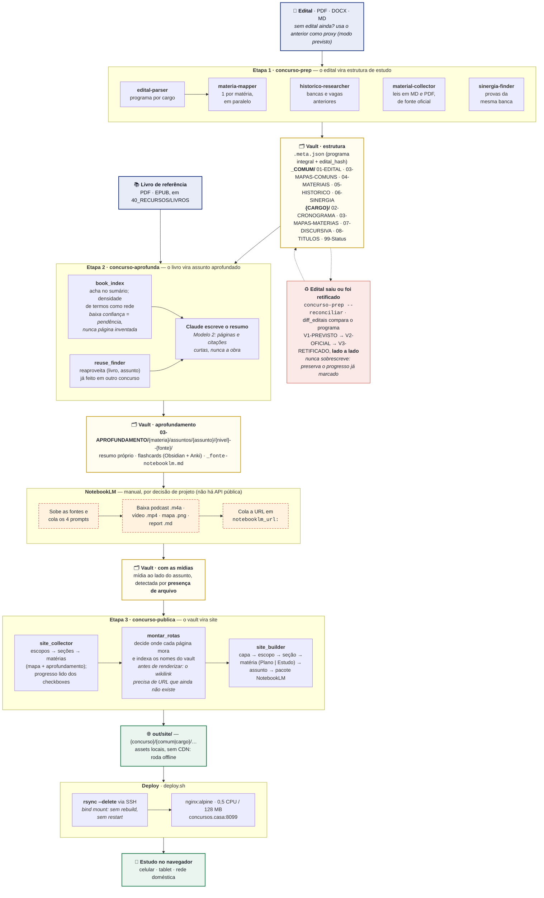

# Arquitetura

## Visão geral

O projeto é uma coleção de skills do Claude Code que produzem material de estudo dentro de um vault Obsidian. Nenhuma delas é um serviço rodando: são **instruções + scripts** que o Claude Code executa sob demanda.

```
Edital (PDF)  ──[concurso-prep]──▶  Estrutura de estudos no vault
                                            │
Livro (PDF/EPUB) ──[concurso-aprofunda]────┤──▶  Assuntos aprofundados
                                            │      + flashcards
                                            └──▶  Pacote NotebookLM (manual)
                                                        │
                                                   podcast / mapa mental
                                                   vídeo / report / slides
                                                        │
                     vault ──[concurso-publica]────────▶ site estático
                                                          (deploy/ → Docker)
```

## O fluxo completo, do edital ao site no ar

Fonte deste diagrama: [`fluxo-concurso.mmd`](fluxo-concurso.mmd) · versão em imagem:
[`fluxo-concurso.png`](fluxo-concurso.png).



Duas coisas no diagrama merecem nota, porque não são escolha estética. A **espinha é
linear** — uma aresta entre etapas consecutivas — e o vault aparece em **três
estados** em vez de uma caixa única com setas entrando e saindo de todo lado: com
fan-out (`a --> b & c`) e cross-links pontilhados, o layout automático do Mermaid
embaralha a ordem de leitura e a Etapa 3 acaba desenhada acima da Etapa 2. Já os
links `~~~` dentro da Etapa 1 são **invisíveis, só de posicionamento**: os quatro
subagents rodam em paralelo, mas sem nenhuma aresta o Mermaid empilha todos no
mesmo rank e a caixa sai alta e vazia.

## Padrão comum às skills

Cada skill segue a mesma anatomia:

- **`SKILL.md`** — o orquestrador. Frontmatter (`name`, `version`, `description` com triggers de ativação) + o fluxo em etapas numeradas que o Claude executa.
- **`scripts/`** — utilitários Python determinísticos (parsing, matching, geração de arquivos, validação). Tudo que *não* depende de julgamento fica aqui, para ser testável.
- **`assets/templates/`** — templates `.md.tpl` com placeholders `{MAIUSCULO}`.
- **`agents/`** (opcional) — subagents especializados, quando o trabalho se beneficia de paralelismo (a `concurso-prep` usa 5).
- **`scripts/tests/test_smoke.py`** — suíte que roda standalone, sem pytest.

### Divisão de trabalho: script vs. agente

Princípio central: **o script monta o arcabouço; o agente preenche o julgamento.**

O `build_subject_md.py`, por exemplo, cria o arquivo do assunto com a localização no livro e as seções vazias marcadas com placeholders. Quem escreve o resumo, escolhe as citações e identifica as pegadinhas é o Claude, na etapa 5 do fluxo. Isso mantém os scripts testáveis e o conteúdo de qualidade.

## Decisões de projeto

### Três skills, não uma

Cada skill tem responsabilidade e ciclo de vida próprios: `concurso-prep` roda uma vez por edital (e de novo em retificações); `concurso-aprofunda` roda por matéria/livro, quantas vezes for preciso; `concurso-publica` roda a cada vez que se quer republicar o site. Separá-las evita uma skill monolítica e permite evoluir cada uma sem risco para as outras.

### O site é derivado, o vault é a fonte

A `concurso-publica` nunca escreve no vault: lê e gera `out/site/`. O progresso exibido vem dos checkboxes dos `.md` — o site é **só leitura**. Isso elimina o problema de duas fontes de verdade divergindo. Regenerar o site é sempre seguro e idempotente.

### Vários aprofundamentos por assunto

Um assunto pode ser aprofundado com fontes diferentes e em dois níveis. A identidade é `{nivel}--{fonte1}[+{fonte2}]` e cada aprofundamento vive na própria pasta, direto sob a pasta do assunto:

```
assuntos/emprego-do-acento-indicativo-de-crase/
├── padrao--pestana/
│   └── emprego-do-acento-indicativo-de-crase--padrao--pestana--SEDES_2026.md
└── detalhado--pestana/
```

O identificador carrega **só o que diferencia**: nível (profundidade), fonte (origem) e — no nome do arquivo — concurso (contexto). Um contador de fontes e um índice posicional existiram numa versão anterior e foram removidos: ambos eram deriváveis do resto, e nome de arquivo que não desempata é custo permanente sem retorno. Já o concurso foi acrescentado por um motivo empírico: 18 arquivos colidiam entre `SEDES_2026` e `BB_2027_PREVISTO`, que usam o mesmo livro para os mesmos assuntos.

A ordem dos componentes é deliberada: **nível primeiro** faz os aprofundamentos do mesmo assunto ordenarem juntos por profundidade na listagem do sistema de arquivos, que é como o usuário navega no Obsidian.

O slug da fonte é o sobrenome de um autor (livro) ou o identificador da norma (`lei-8742`, `res-cmn-4893`). Essa dualidade não é acidente: cerca de 40% do material do vault vem de legislação, que não tem autor — um padrão só com "sobrenome" não cobriria o caso real. Quando a derivação automática não consegue deduzir (obra com dois autores, arquivo sem autor no nome), o script **avisa e exige slug explícito** em vez de gravar um path ruim; é o mesmo princípio de "nunca fingir precisão" aplicado a nomes.

Os nomes de arquivo repetem o identificador porque o Obsidian resolve wikilinks por nome de arquivo, e dois `crase.md` seriam ambíguos. Os formatos anteriores (`aprofundamentos/{id}/` e arquivo direto na pasta do assunto) continuam sendo lidos: quem não migrar não pode ficar sem site.

A convenção é implementada uma única vez, em `skills/concurso-aprofunda/scripts/aprofundamento_id.py`. Como as skills são instaladas de forma independente, a `concurso-publica` não pode importá-la — tem uma **cópia sincronizada**, com teste de smoke nas duas pontas que falha se divergirem. Cópia com detector de drift foi preferida a um pacote compartilhado porque o instalador copia skills isoladas para `~/.claude/skills/`, sem resolução de dependências.

### A arquitetura de informação do site

O site espelha a organização do vault: `{concurso}/{comum|cargo}/`, com as seções
numeradas e `materias/{materia}/{assunto}/`. O espelho é deliberado — é a estrutura
que o usuário já navega no Obsidian, e inventar outra obrigaria a manter duas
taxonomias na cabeça.

**Hub e trilha, não árvore.** Não há sidebar com árvore de pastas. Cada nível é uma
página que explica o que há embaixo, e a trilha no topo diz onde se está.
Reproduzir o explorador do Obsidian no navegador não acrescentaria nada: quem abre o
site vem consumir, não gerenciar.

**Dois registros visuais.** As pastas numeradas do vault existem para ordenar no
explorador de arquivos — `05-HISTORICO` vem antes de `06-SINERGIA` porque alguém
escolheu os números. Espelhar essa numeração como *peso visual* faria "Sinergia"
competir com "Crase". Por isso o que se **estuda** ganha card com progresso, e o que
se **consulta** vira lista tipográfica, num registro mais quieto.

**Uma matéria, duas visões.** O mapa de matéria e o aprofundamento cobrem o mesmo
recorte por ângulos diferentes: o mapa é o plano do edital (tópicos e checklists), o
aprofundamento é o conteúdo (resumo, páginas do livro, flashcards). Ficam na mesma
página, em abas. Separá-los em duas seções obrigaria a saber em qual procurar.

**O link fino tópico→assunto não é derivável, e por isso não é inventado.** Dos 203
tópicos dos 24 mapas do vault, cerca de 18% casam com o slug de um assunto. As
causas são legítimas: um tópico do edital pode explodir em vários assuntos (no SEDES,
"Domínio da estrutura morfossintática" cobre 7); nas matérias aprofundadas por
legislação o assunto **é** uma norma, então a relação é N:M e há tópico atendido por
assunto de *outra* matéria; e assuntos reaproveitados de outro concurso mantêm o slug
do edital de origem. O perigo não é a ausência de link — é o **falso negativo**: um
tópico sem link lido como "não tem aprofundamento" quando ele existe com outro nome
esconderia trabalho já feito. Aplica-se aqui a mesma regra de nunca fingir precisão
que rege a localização no livro: sem casamento exato, a página não afirma nada. Quem
quiser o link fino preenche um `mapa-aliases.json` opcional.

**O pacote NotebookLM é página por assunto, não por pacote.** Existem 92 pacotes no
vault e 72 assuntos: entre `padrao--X` e `detalhado--X` do mesmo assunto, só o prompt
de áudio difere — o resto é nome de arquivo. Uma página por pacote daria ~95% de
conteúdo repetido, então as versões viram abas. E é a única página do site cuja razão
de existir é uma **ação**: o vault tem 92 roteiros prontos e um único assunto com
mídia gerada, então o gargalo não é ter o roteiro, é executá-lo. Daí o botão de
copiar em cada prompt.

**Índices do vault são derivados, não republicados.** `00-INDICE.md` e `99-Status.md`
existem para navegar no Obsidian; na web, a navegação do site **é** o índice, e o
progresso do status vira a barra do hub do escopo. Republicá-los criaria uma segunda
lista que envelhece — mas eles continuam sendo *lidos*, porque é deles que saem a
ordenação das matérias e os selos de questões e prioridade (só 1 dos 24 mapas traz
`estimativa_questoes` no frontmatter).

**Rotas antes de renderizar.** O build tem dois passos: primeiro decide onde cada
página vai morar e indexa os nomes de arquivo do vault, depois renderiza. A ordem é
imposta pelo resolvedor de wikilinks — para virar `href`, `[[crase]]` precisa da URL
de uma página que talvez ainda não tenha sido gerada. Com um passo só, o resolvedor
não conseguia ver além dos assuntos irmãos da mesma matéria, e todo wikilink que
atravessasse matéria ou apontasse para documento morria por construção. O índice tem
três classes de alvo, porque nem todo alvo é página: página, artefato embutido
(flashcards, que viram âncora do quiz) e arquivo copiado (mídia, anexo).

Cuidado que vale registrar: o índice de nomes resolve por *basename*, e nomes repetem
entre escopos (`lingua-portuguesa` existe no comum e em cada cargo do BB;
`cronograma-macro.md` existe em três cargos do SEDES). Ele serve para **wikilink**,
onde a ambiguidade é inerente ao formato. Link de **navegação** é sempre calculado da
rota da própria página — usar o índice fazia o hub do cargo apontar para a matéria do
comum e deixava a própria órfã.

### Deploy por sincronização de arquivos

O container Docker serve o site por **bind mount**, não por cópia para dentro da imagem. Atualizar é `rsync`: sem rebuild, sem restart, sem downtime. Servir estático é I/O, não CPU — por isso 0.5 CPU e 128 MB bastam com folga para uso doméstico.

O container responde **direto** em `concursos.casa:8099`, servindo na raiz — sem proxy reverso na frente. A configuração anterior (subpath `/concursos` atrás do proxy de outro host) foi abandonada por acrescentar uma peça sem benefício num ambiente de rede doméstica. O caminho antigo continua redirecionando, com `rewrite`, para preservar deep links.

Duas diretivas do nginx merecem registro porque não são óbvias: `absolute_redirect off` e `port_in_redirect off`. O container escuta na 80 e é publicado na 8099; sem elas o nginx monta o cabeçalho `Location` dos redirects com a porta **interna**, e todo link antigo cai numa porta que não existe do lado de fora.

Como o gerador sempre emitiu **links relativos**, mudar de subpath para raiz não exigiu nenhuma alteração no `site_builder.py` — o mesmo site funciona nos dois modos.

### Versões lado a lado, nunca sobrescrita

Quando um edital previsto vira oficial, ou um oficial é retificado, a estrutura antiga é **arquivada**, não substituída: `V1-PREVISTO` → `V2-OFICIAL` → `V3-RETIFICADO`. O motivo é preservar o trabalho do estudante — se o diff errar, nada se perdeu. A migração de progresso é feita por arquivo de matéria, com aviso do que mudou.

### Modelo 2 (direitos autorais)

Três modelos foram considerados para o material extraído do livro:

1. ponteiros + resumo original;
2. **ponteiros + resumo original + trechos curtos citados** ← adotado;
3. extração integral do texto.

O modelo 3 foi descartado: reproduz a obra. O modelo 2 entrega o que ajuda de fato a estudar (onde ler, o que é essencial, o que a banca cobra) sem copiar o livro.

### NotebookLM manual, automação como camada opcional

Não existe API pública de consumidor do NotebookLM. A via da comunidade (`notebooklm-py`) usa endpoints internos não-documentados do Google e pode quebrar sem aviso. Por isso a skill **gera o pacote de embarque** (fontes a subir, prompts prontos por gerável, roteiro de cliques) e o usuário executa manualmente. Se a automação for adicionada, entra como camada **sobre** o modo manual, que continua sendo o caminho garantido.

### Localização no livro: TOC primeiro, densidade como rede

O `book_index.py` tenta casar os assuntos com o **sumário** do livro (preciso quando existe). Sem sumário utilizável, cai para **densidade de termos** por página. Ambos retornam um score, e baixa confiança vira pendência explícita — a skill nunca inventa uma página.

## Fluxo de dados entre as skills

A `concurso-prep` grava `.meta.json` na raiz da pasta do concurso com o conteúdo programático integral. A `concurso-aprofunda` lê os assuntos mapeados a partir daí (ou dos mapas de matéria) para saber o que procurar no livro. O `reuse_finder.py` varre o vault inteiro procurando `(livro, assunto)` já aprofundados em **outros** concursos, para reaproveitar em vez de refazer.

## Dependências e degradação

Todas as dependências Python são opcionais e o comportamento degrada com aviso, nunca com falha total:

| Ausente | Efeito |
|---|---|
| `reportlab` / `weasyprint` | leis saem só em `.md` (sem PDF) |
| `pyyaml` | apenas `.meta.yml` legado indisponível; `.meta.json` é o padrão |
| `tesseract` | PDFs escaneados viram pendência em vez de serem lidos |
| `pdftotext` | bloqueia leitura de PDF (é o único praticamente obrigatório) |
