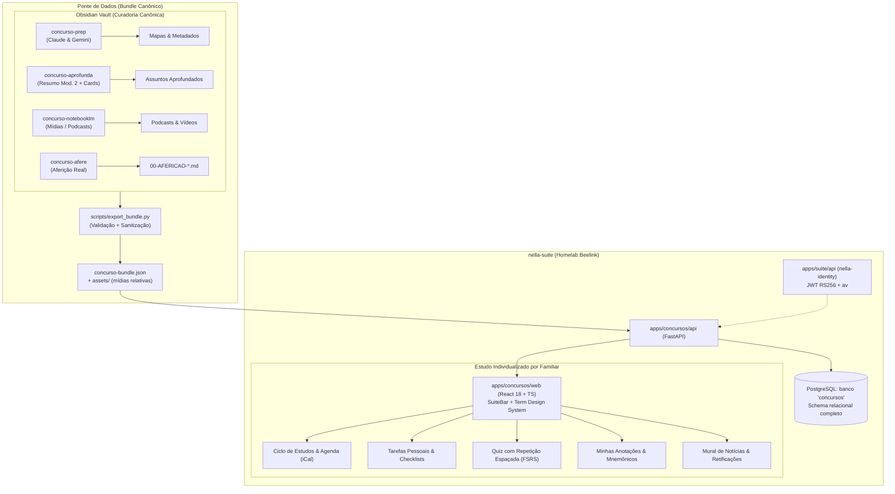

# Plano Técnico Detalhado: Evolução do Vault, Backend FastAPI no nella-suite e Estudo Individualizado

**Data:** 2026-09-29  
**Status:** ~~Aprovado~~ **Superado em 2026-10-03** (ver aviso abaixo)  
**Autores:** Sebastião Gonella & Antigravity  
**Projetos Envolvidos:** `14_concursos` (repo local) e `15_nella-suite` (monorepo da suíte)  
**Fonte da Decisão no Vault:** `20_PROJETOS/PROFISSIONAL/14_concursos/DECISOES/2026-09-29-modulo-concursos-com-backend-na-suite-e-estudo-individualizado.md`

> **⚠️ Superado pela ADR-007 da nella-suite (2026-10-03).** A direção foi mantida — app
> `concursos` com backend próprio e estudo individual —, mas o desenho foi revisto: o app entra
> como **perfil A** e segue os padrões da suíte. Ficam **sem efeito** neste plano:
> `user_concurso_grants` e o acesso por `associated DEFAULT true` (as concessões seguem o formato
> da suíte, com grupos e nível); admin vendo progresso alheio (nenhum papel de admin vê dado
> privado); iCal com token na URL (só download autenticado); `ON DELETE CASCADE` em dado do
> usuário e `card_id` por hash da frente (o conteúdo canônico é retirado, não apagado, e o id do
> flashcard é estável, atribuído no vault). O pipeline do vault — este repositório, incluindo o
> `export_bundle` — segue como "trilha C"; só o contrato do bundle entra na especificação da
> suíte. Mantido no git como registro do que foi proposto; a avaliação dele está em
> [`REVISAO-CRITICA-E-PONDERACOES-SOBRE-O-LEVANTAMENTO-GEMINI.md`](REVISAO-CRITICA-E-PONDERACOES-SOBRE-O-LEVANTAMENTO-GEMINI.md).

---

## 1. Visão Geral e Alinhamento Estratégico

Este documento estabelece a arquitetura técnica, os contratos de dados e o roteiro de implementação para a evolução do ecossistema de preparação para concursos públicos.

### 1.1 Princípios Inegociáveis
1. **O Obsidian é o Cérebro Canônico:** Todas as etapas de inteligência, análise de edital, criação de resumos no Modelo 2, mapeamento doutrinário, extração de leis, preparação de pacotes NotebookLM e aferição de provas reais **permanecem no Obsidian Vault**. O conhecimento é curado pelo usuário auxiliado por modelos Claude e Gemini.
2. **Desacoplamento Front/Back:** O gerador estático HTML legado (`skills/concurso-publica/`) é substituído por um **extrator de bundle canônico** (`concurso-export`).
3. **Módulo Web Integrado ao nella-suite com Backend Próprio:** Para suportar controle de acesso por concurso/cargo, edição de tarefas/anotações pessoais e estudo individualizado por membro da família, o app `concursos` na suíte terá **backend dedicado em FastAPI** e persistência em **PostgreSQL**, conforme o padrão da suíte (`PADRAO-APP-SUITE.md`, ID `APP-CONC-01`).
4. **Isolamento de Progresso e Estudo Individualizado:** O avanço de estudo, checklists, agenda (Ciclo de Estudos) e histórico de repetição espaçada (FSRS) são **100% individuais por usuário** e desacoplados dos arquivos Markdown do vault.



---

## 2. Evolução no Repositório `14_concursos` (Vault Core)

### 2.1 Suporte Dual-Engine (Claude Code + Gemini / Antigravity)
- **Compatibilização de Subagents:**
  - Os subagents em `skills/concurso-prep/agents/*.md` (`edital-parser`, `materia-mapper`, `material-collector`, `historico-researcher`, `sinergia-finder`) são adaptados para funcionar tanto no Claude Code quanto no Antigravity CLI (via `invoke_subagent` ou execução direta).
- **Atualização do `scripts/install.sh`:**
  - Nova flag `scripts/install.sh --gemini`: registra as skills em `~/.gemini/config/skills.json` garantindo que o comando Antigravity as descubra e execute sem atrito.
- **Parsing Multimodal de Editais:**
  - No `extract_edital.py`, adição do motor multimodal para Gemini: editais em PDF com tabelas complexas de vagas, cotas, critérios de pontuação de títulos e distribuição de pesos passam a ser lidos como documento nativo, eliminando falhas de quebra de colunas do `pdftotext -layout`.

### 2.2 Indexação Semântica de Livros e Doutrina (`book_index.py`)
- Em livros densos sem sumário (TOC) estruturado em texto, o fallback atual por contagem simples de termos gera falsos positivos.
- Evolução: Adicionar camada leve de busca vetorial/semântica (embeddings locais ou API de embeddings) para ranquear os capítulos e páginas com precisão de conceito antes de montar o arcabouço.

### 2.3 Fechamento do Ciclo da Aferição (`remediar_afericao.py`)
- A etapa `concurso-afere` hoje produz relatórios detalhados (`00-AFERICAO-*.md`) com o veredicto de cada questão (`✅ RESPONDE`, `⚠️ PARCIAL`, `❌ NÃO RESPONDE`, `⬜ SEM MATERIAL`).
- Novo script `remediar_afericao.py`:
  - Lê os itens `❌` e `⚠️` da aferição.
  - Identifica o assunto correspondente no vault.
  - Altera o frontmatter para `status: revisar` e adiciona tag `#gap/afericao`.
  - Gera um pacote pronto de enriquecimento para alimentar diretamente o `concurso-aprofunda --modo ampliar`.

### 2.4 Extrator de Bundle Canônico (`scripts/export_bundle.py`)
Substitui o pipeline de renderização HTML de `concurso-publica`.
- **Comando:**
  ```bash
  python3 scripts/export_bundle.py --concurso-dir <caminho_vault/SEDES_2026> --out out/bundles/
  ```
- **O que faz:**
  1. **Sanitização de Caminhos:** Remove todos os paths absolutos locais (`/home/sebagonella/...`) dos manifestos e metadados.
  2. **Normalização de Links:** Converte `[[wikilinks]]` internos em referências canônicas universais `{materia_slug}/{assunto_slug}`.
  3. **Empacotamento de Dados:** Emite `concurso-bundle.json` contendo:
     - Metadados do concurso, cargos, vagas e datas.
     - Estrutura completa de matérias e tópicos do plano.
     - Resumos completos em Markdown (Modelo 2).
     - Flashcards com IDs determinísticos (hash do front).
     - Catálogo de mídias e identificadores de podcast/vídeo do NotebookLM.
  4. **Exportação de Mídias Relativas:** Copia áudios, vídeos e PDFs para `out/bundles/{CONCURSO}/media/` com nomes canônicos.
  5. **Checksum & Versão:** Gera SHA-256 do bundle para garantir idempotência na importação.

---

## 3. Arquitetura do Módulo `apps/concursos/` no `nella-suite`

### 3.1 Padrão de App da Suíte (`PADRAO-APP-SUITE.md`)
- **Identificador:** `APP-CONC-01` (Área: Profissional / Concursos).
- **Backend:** `apps/concursos/api` (Python 3.12, FastAPI, SQLAlchemy 2, Alembic, psycopg 3).
- **Frontend:** `apps/concursos/web` (React 18, TypeScript strict, Vite, Tailwind, TanStack Query/Router).
- **Banco de Dados:** PostgreSQL 16 (banco `concursos`, role `concursos_runtime`, migrações com Alembic via `concursos_migrator`).
- **Autenticação & Autorização:** `nella-auth` com validação JWT RS256 via JWKS do `nella-identity`, validação do claim `mods{"concursos": "member" | "admin"}` e verificação de `authz_version` (`av`).

---

### 3.2 Schema Relacional Completo no PostgreSQL

O banco de dados do app `concursos` é dividido em três camadas bem definidas:

```sql
-- ============================================================================
-- CAMADA 1: Identidade Espelhada (nella-auth)
-- ============================================================================

CREATE TABLE suite_users (
    sub UUID PRIMARY KEY,
    email CITEXT NOT NULL UNIQUE,
    name TEXT NOT NULL,
    is_active BOOLEAN NOT NULL DEFAULT true,
    associated BOOLEAN NOT NULL DEFAULT true,
    app_role TEXT NOT NULL DEFAULT 'member', -- 'admin' ou 'member'
    implicit_admin BOOLEAN NOT NULL DEFAULT false,
    authz_version INT NOT NULL DEFAULT 1,
    generation INT NOT NULL DEFAULT 1,
    synced_at TIMESTAMPTZ NOT NULL DEFAULT now(),
    created_at TIMESTAMPTZ NOT NULL DEFAULT now()
);

CREATE TABLE suite_groups (
    id UUID PRIMARY KEY,
    name TEXT NOT NULL,
    kind TEXT NOT NULL DEFAULT 'suite', -- 'suite' ou 'module'
    created_at TIMESTAMPTZ NOT NULL DEFAULT now()
);

CREATE TABLE suite_group_members (
    group_id UUID NOT NULL REFERENCES suite_groups(id) ON DELETE CASCADE,
    user_id UUID NOT NULL REFERENCES suite_users(sub) ON DELETE CASCADE,
    PRIMARY KEY (group_id, user_id)
);

-- ============================================================================
-- CAMADA 2: Conteúdo Canônico (Importado do Vault via Bundle)
-- ============================================================================

CREATE TABLE concursos (
    id TEXT PRIMARY KEY, -- ex: 'SEDES_2026', 'BB_2027_PREVISTO'
    orgao TEXT NOT NULL,
    sigla TEXT NOT NULL,
    ano INT NOT NULL,
    banca TEXT NOT NULL,
    modo TEXT NOT NULL CHECK (modo IN ('oficial', 'previsto')),
    data_prova DATE,
    edital_hash TEXT NOT NULL,
    meta_json JSONB NOT NULL,
    versao_bundle INT NOT NULL DEFAULT 1,
    bundle_hash TEXT NOT NULL,
    criado_em TIMESTAMPTZ NOT NULL DEFAULT now(),
    atualizado_em TIMESTAMPTZ NOT NULL DEFAULT now()
);

CREATE TABLE cargos (
    id TEXT PRIMARY KEY, -- ex: 'SEDES_2026:EDAS-ADMINISTRACAO'
    concurso_id TEXT NOT NULL REFERENCES concursos(id) ON DELETE CASCADE,
    sigla TEXT NOT NULL,
    nome_exibicao TEXT NOT NULL,
    vagas JSONB,
    salario_inicial_cents BIGINT,
    criado_em TIMESTAMPTZ NOT NULL DEFAULT now()
);

CREATE TABLE materias (
    id TEXT PRIMARY KEY, -- ex: 'SEDES_2026:lingua-portuguesa'
    concurso_id TEXT NOT NULL REFERENCES concursos(id) ON DELETE CASCADE,
    materia_id TEXT NOT NULL,
    nome TEXT NOT NULL,
    escopo TEXT NOT NULL, -- '_COMUM' ou ID do cargo
    prioridade TEXT NOT NULL CHECK (prioridade IN ('alta', 'media', 'base')),
    questoes_estimadas INT,
    conteudo_mapa_md TEXT,
    ordem INT NOT NULL DEFAULT 0
);

CREATE TABLE assuntos (
    id TEXT PRIMARY KEY, -- ex: 'SEDES_2026:lingua-portuguesa:crase'
    materia_id TEXT NOT NULL REFERENCES materias(id) ON DELETE CASCADE,
    slug TEXT NOT NULL,
    titulo TEXT NOT NULL,
    topico_literal TEXT,
    nivel TEXT NOT NULL CHECK (nivel IN ('padrao', 'detalhado')),
    fontes TEXT NOT NULL,
    resumo_md TEXT NOT NULL, -- Resumo canônico do Modelo 2
    localizacao_livro TEXT,
    trechos_ancora_md TEXT,
    pegadinhas_md TEXT,
    divergencias_md TEXT,
    notebooklm_url TEXT,
    midias JSONB NOT NULL DEFAULT '[]'::jsonb, -- [{tipo, filename, url}]
    ordem INT NOT NULL DEFAULT 0
);

CREATE TABLE flashcards (
    id TEXT PRIMARY KEY, -- Hash do front do card (determinístico)
    assunto_id TEXT NOT NULL REFERENCES assuntos(id) ON DELETE CASCADE,
    frente TEXT NOT NULL,
    verso TEXT NOT NULL,
    tags JSONB NOT NULL DEFAULT '[]'::jsonb
);

CREATE TABLE concurso_news (
    id UUID PRIMARY KEY DEFAULT gen_random_uuid(),
    concurso_id TEXT NOT NULL REFERENCES concursos(id) ON DELETE CASCADE,
    titulo TEXT NOT NULL,
    conteudo_md TEXT NOT NULL,
    url_fonte TEXT,
    data_publicacao DATE NOT NULL,
    tipo TEXT NOT NULL CHECK (tipo IN ('retificacao', 'comunicado', 'gabarito', 'convocacao', 'geral')),
    destaque BOOLEAN NOT NULL DEFAULT false,
    criado_em TIMESTAMPTZ NOT NULL DEFAULT now()
);

-- ============================================================================
-- CAMADA 3: Governança, Acesso e Estudo Individualizado
-- ============================================================================

-- Controle de acesso granular a concurso/cargo
CREATE TABLE user_concurso_grants (
    user_id UUID NOT NULL REFERENCES suite_users(sub) ON DELETE CASCADE,
    concurso_id TEXT NOT NULL REFERENCES concursos(id) ON DELETE CASCADE,
    cargo_id TEXT REFERENCES cargos(id) ON DELETE CASCADE,
    pode_visualizar BOOLEAN NOT NULL DEFAULT true,
    pode_estudar BOOLEAN NOT NULL DEFAULT true,
    pode_anotar BOOLEAN NOT NULL DEFAULT true,
    concedido_por UUID NOT NULL REFERENCES suite_users(sub),
    concedido_em TIMESTAMPTZ NOT NULL DEFAULT now(),
    PRIMARY KEY (user_id, concurso_id)
);

-- Perfil de Estudo do Usuário para o Concurso
CREATE TABLE study_profiles (
    user_id UUID NOT NULL REFERENCES suite_users(sub) ON DELETE CASCADE,
    concurso_id TEXT NOT NULL REFERENCES concursos(id) ON DELETE CASCADE,
    cargo_id TEXT NOT NULL REFERENCES cargos(id) ON DELETE CASCADE,
    metodo TEXT NOT NULL DEFAULT 'ciclo' CHECK (metodo IN ('ciclo', 'linear')),
    horas_dia_semana NUMERIC(3,1) NOT NULL DEFAULT 3.0,
    horas_fim_semana NUMERIC(3,1) NOT NULL DEFAULT 5.0,
    ativo BOOLEAN NOT NULL DEFAULT true,
    criado_em TIMESTAMPTZ NOT NULL DEFAULT now(),
    atualizado_em TIMESTAMPTZ NOT NULL DEFAULT now(),
    PRIMARY KEY (user_id, concurso_id)
);

-- Itens do Ciclo de Estudos Individualizado
CREATE TABLE study_cycle_items (
    id UUID PRIMARY KEY DEFAULT gen_random_uuid(),
    user_id UUID NOT NULL REFERENCES suite_users(sub) ON DELETE CASCADE,
    concurso_id TEXT NOT NULL REFERENCES concursos(id) ON DELETE CASCADE,
    materia_id TEXT NOT NULL REFERENCES materias(id) ON DELETE CASCADE,
    ordem INT NOT NULL,
    meta_minutos INT NOT NULL, -- Tempo alocado por volta do ciclo (ex: 90 min)
    minutos_concluidos INT NOT NULL DEFAULT 0,
    concluido_na_rodada BOOLEAN NOT NULL DEFAULT false,
    CONSTRAINT uk_user_cycle_order UNIQUE (user_id, concurso_id, ordem)
);

-- Registro de Sessões de Estudo Executadas
CREATE TABLE study_sessions (
    id UUID PRIMARY KEY DEFAULT gen_random_uuid(),
    user_id UUID NOT NULL REFERENCES suite_users(sub) ON DELETE CASCADE,
    assunto_id TEXT NOT NULL REFERENCES assuntos(id) ON DELETE CASCADE,
    duracao_minutos INT NOT NULL,
    modo TEXT NOT NULL CHECK (modo IN ('teoria', 'questoes', 'revisao', 'podcast')),
    questoes_feitas INT DEFAULT 0,
    questoes_acertos INT DEFAULT 0,
    executado_em TIMESTAMPTZ NOT NULL DEFAULT now()
);

-- Progresso Individual de Tópicos e Checklists
CREATE TABLE user_topic_progress (
    user_id UUID NOT NULL REFERENCES suite_users(sub) ON DELETE CASCADE,
    assunto_id TEXT NOT NULL REFERENCES assuntos(id) ON DELETE CASCADE,
    status TEXT NOT NULL DEFAULT 'nao_iniciado' CHECK (status IN ('nao_iniciado', 'em_estudo', 'revisar', 'concluido')),
    teoria_lida BOOLEAN NOT NULL DEFAULT false,
    resumo_estudado BOOLEAN NOT NULL DEFAULT false,
    percentual_dominio INT NOT NULL DEFAULT 0 CHECK (percentual_dominio BETWEEN 0 AND 100),
    atualizado_em TIMESTAMPTZ NOT NULL DEFAULT now(),
    PRIMARY KEY (user_id, assunto_id)
);

-- Anotações Pessoais do Usuário (Overlay sobre o texto canônico)
CREATE TABLE user_notes (
    user_id UUID NOT NULL REFERENCES suite_users(sub) ON DELETE CASCADE,
    assunto_id TEXT NOT NULL REFERENCES assuntos(id) ON DELETE CASCADE,
    anotacoes_md TEXT NOT NULL DEFAULT '',
    mnemonicos_md TEXT NOT NULL DEFAULT '',
    atualizado_em TIMESTAMPTZ NOT NULL DEFAULT now(),
    PRIMARY KEY (user_id, assunto_id)
);

-- Repetição Espaçada de Flashcards (Motor FSRS na Web)
CREATE TABLE user_flashcard_reviews (
    user_id UUID NOT NULL REFERENCES suite_users(sub) ON DELETE CASCADE,
    card_id TEXT NOT NULL REFERENCES flashcards(id) ON DELETE CASCADE,
    state INT NOT NULL DEFAULT 0, -- 0=New, 1=Learning, 2=Review, 3=Relearning
    difficulty NUMERIC(4,2) NOT NULL DEFAULT 5.0,
    stability NUMERIC(6,2) NOT NULL DEFAULT 1.0,
    reps INT NOT NULL DEFAULT 0,
    lapses INT NOT NULL DEFAULT 0,
    last_review TIMESTAMPTZ,
    due TIMESTAMPTZ NOT NULL DEFAULT now(),
    PRIMARY KEY (user_id, card_id)
);
```

---

## 4. Detalhamento dos Módulos do Sistema

### 4.1 Ciclo de Estudos e Agenda Individualizada
Diferente de um calendário rígido ("Segunda = Direito"), o **Ciclo de Estudos** é comprovadamente superior para concursos:
1. As matérias são ordenadas em uma fila circular baseada no peso do edital e dificuldade pessoal.
2. Cada matéria recebe uma meta em minutos (ex: Português 90 min → SUAS 120 min → AFO 90 min → Legislação 60 min).
3. O estudante clica em **"Iniciar Bloco"**: um cronômetro Pomodoro embutido roda na interface.
4. Ao encerrar o bloco, o tempo é creditado na rodada atual do ciclo. Quando todas as matérias concluem sua meta, a rodada fecha e reinicia.
5. **Feed iCal Pessoal:** O backend disponibiliza `GET /api/concursos/me/calendar.ics?key=<user_token>`, projetando revisões agendadas e blocos planejados no calendário do smartphone (Google Agenda / Apple Calendar).

### 4.2 Repetição Espaçada de Flashcards (FSRS Web)
- O estudante acessa a aba "Flashcards" no celular ou computador.
- O sistema busca os cards vencidos (`due <= now()`).
- O usuário avalia cada resposta com 4 botões:
  - **Errei** (Again)
  - **Difícil** (Hard)
  - **Bom** (Good)
  - **Fácil** (Easy)
- O algoritmo FSRS calcula a nova estabilidade e define a data exata da próxima repetição, garantindo taxa de retenção de 90%.

### 4.3 Anotações Pessoais e Mnemônicos
- Na página do assunto, o **resumo do Modelo 2 gerado no Obsidian** é exibido como texto oficial imutável.
- Ao lado (ou logo abaixo em telas mobile), o estudante dispõe de um editor de Markdown pessoal com salvamento automático para anotar:
  - Casos práticos e exemplos próprios.
  - Mnemônicos para memorização.
  - Pontos de dúvida a revisar com o mentor da família.

### 4.4 Mural de Notícias Oficiais da Banca
- O concurso possui um painel de comunicados oficiais.
- Quando um comunicado urgente (como retificação de edital, alteração de local de prova ou gabarito oficial) é publicado:
  - O sistema exibe um badge de destaque no topo da interface.
  - Usuários que selecionaram aquele cargo recebem o alerta de prioridade.

### 4.5 Administração de Concursos e Usuários
- Usuários com `role='admin'` no app (Sebastião) têm acesso à rota `/concursos/admin`:
  - Visão geral de quais concursos estão importados.
  - Concessão de permissões para os membros da família:
    - *"Usuário A tem acesso a SEDES_2026 no cargo Assistente Social"*.
    - *"Usuário B tem acesso a BB_2027 no cargo Agente Comercial"*.
  - Acompanhamento do progresso geral da família (horas estudadas na semana, assuntos concluídos).

---

## 5. Roteiro de Implementação Passo a Passo

### Fase 1: Vault & Ferramental Canônico (`14_concursos`)
1. Implementar `scripts/export_bundle.py` no `14_concursos` e testar geração para `SEDES_2026` e `BB_2027_PREVISTO`.
2. Adicionar suporte a `--gemini` no `scripts/install.sh`.
3. Criar `scripts/remediar_afericao.py` na `concurso-afere` para fechamento automático do ciclo de melhorias.

### Fase 2: Fundação do App na Suíte (`15_nella-suite`)
1. Criar pastas `apps/concursos/api` e `apps/concursos/web`.
2. Configurar `bootstrap.d/concursos.sql` para criação do banco `concursos` e role `concursos_runtime`.
3. Criar migrações Alembic com as tabelas das Camadas 1, 2 e 3.
4. Implementar dependência `nella_auth.authorize('concursos')` na API FastAPI.

### Fase 3: Importador de Bundle e Interface Base
1. Implementar endpoint/CLI de importação do `concurso-bundle.json`.
2. Desenvolver interface web em React com `@nella/design-system` e `@nella/shell-ui`.
3. Implementar navegação de Concursos, Cargos, Matérias e Assuntos com player de podcast embutido.

### Fase 4: Estudo Individualizado
1. Implementar motor de Ciclo de Estudos com cronômetro de sessão.
2. Implementar motor FSRS de flashcards com interface de quiz web.
3. Desenvolver editor de anotações pessoais (`user_notes`) e endpoint de exportação iCal.
4. Implementar mural de notícias e painel administrativo `/concursos/admin`.
